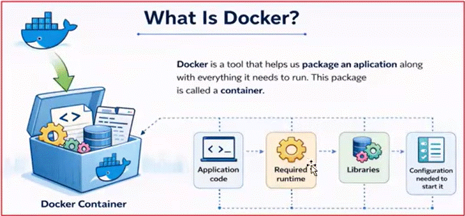
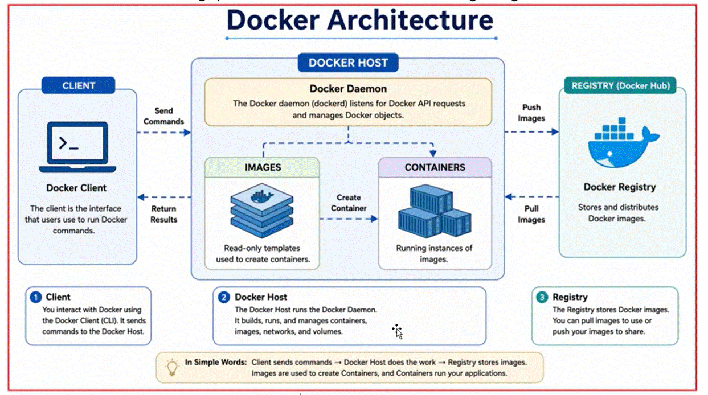
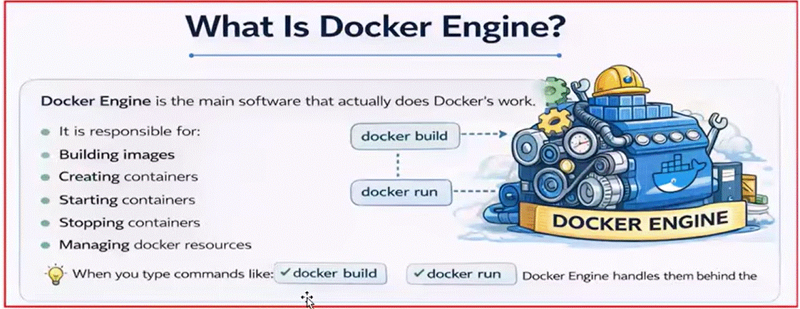
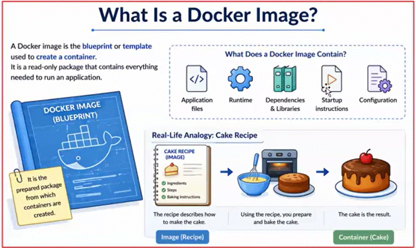
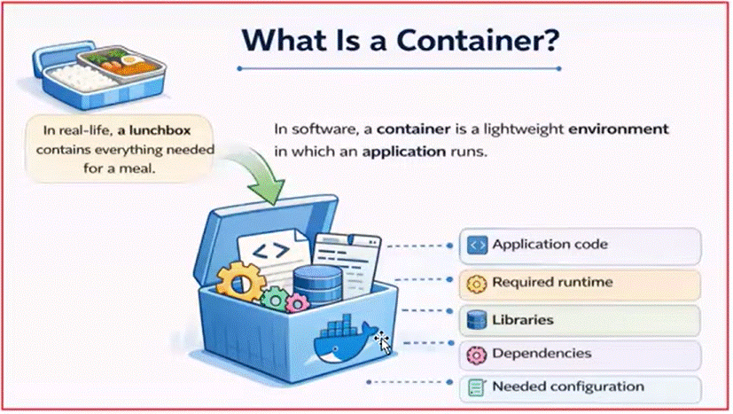

# Docker Core Concepts

## Docker Architecture

## 1. Docker Architecture (Big Picture)

Client → Docker Host (Daemon) → Registry (Docker Hub)

---

## 2. Components

### 2.1 Docker Client

- CLI tool (docker command)
- Sends commands to Docker Daemon

Example:
docker run hello-world

---

### 2.2 Docker Engine (Docker Daemon)

- Core service (dockerd)
- Runs on Docker Host
- Responsible for:
  - Pulling images
  - Creating containers
  - Managing networks and volumes

---

### 2.3 Docker Host

- Machine where Docker runs
- Can be:
  - Local machine
  - Cloud VM
  - Server

Contains:
- Docker Engine
- Images
- Containers

---

### 2.4 Docker Image

- Read-only template
- Contains:
  - Application
  - Dependencies
  - Runtime

Example:
hello-world
nginx
mcr.microsoft.com/dotnet/aspnet

---

### 2.5 Container

- Running instance of an image
- Lightweight and isolated

Key:
Image → blueprint  
Container → running app  

---

### 2.6 Docker Registry (Docker Hub)

- Stores Docker images
- Public or private

Examples:
- Docker Hub
- Azure Container Registry (ACR)

---

## 3. What Happens When You Run

### Command:
docker run hello-world

### Step-by-step Flow:

1. Docker Client sends command to Docker Daemon

2. Docker Daemon checks:
   - Is image available locally?

3. If NOT:
   - Pulls image from Docker Hub

4. Creates container from image

5. Runs container

6. Container executes program

7. Output is sent back to terminal

---

## 4. Why Container Shows "Exited"

hello-world container:
- Runs once
- Prints message
- Stops

Check:
docker ps -a

Status:
Exited (0) → successful execution

---

## 5. Important Commands

### List running containers
docker ps

### List all containers
docker ps -a

### List images
docker images

### Remove container
docker rm <id>

### Remove image
docker rmi <image>

---

## 6. Key Differences

| Concept | Meaning |
|--------|--------|
| Image | Blueprint |
| Container | Running instance |
| Docker Engine | Runtime system |
| Docker Hub | Image storage |

---

## 7. Real Understanding Check

You must answer:

### Q1:
Why did docker pull image automatically?

→ Because image not found locally

---

### Q2:
Why container exited immediately?

→ No long-running process

---

### Q3:
Where is Docker actually running?

→ On Docker Host (your machine / VM)

---

## 8. Common Mistakes

- Thinking container = VM
- Not understanding image vs container
- Ignoring container lifecycle
- Running DB in container without persistence

---

## 9. Summary

- Client → sends command  
- Engine (Daemon) → does work  
- Image → blueprint  
- Container → running app  
- Registry → stores images  

Docker = packaging + running applications consistently